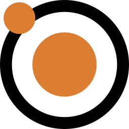
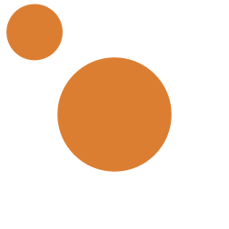
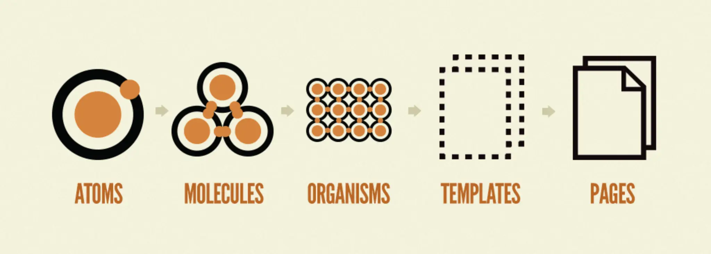

<div align="center">
  <a href="https://github.com/tyronejosee/project_new_store#gh-light-mode-only" target="_blank">
    
  </a>
  <a href="https://github.com/tyronejosee/project_new_store#gh-dark-mode-only" target="_blank">
    
  </a>
</div>
<div align="center">
  <h1><strong>Prototype React Atomic Design</strong></h1>
</div>
<p align="center">
Atomic design is a design approach based on the idea that parts of a product or system should be composed of minimal and reusable elements. This allows designers and developers to work with smaller, more easily reusable components, resulting in faster and more efficient design.
<p>

<p align="center">
  <a href="https://www.typescriptlang.org/">
    
  </a>
  <a href="https://reactjs.org/">
    
  </a>
  <a href="https://reactrouter.com/">
    
  </a>
  <a href="https://vitejs.dev/">
    
  </a>
  <a href="https://tailwindcss.com/">
    
  </a>
  <a href="https://eslint.org/">
    
  </a>
</p>



> **Read more [EN](./public/book-en.pdf) / [ES](./public/book-es.pdf)**

## 🚀 Getting Started

Clone repository.

```bash
git clone git@github.com:tyronejosee/prototype_react_atomic_design.git
cd prototype_react_atomic_design
```

Install dependencies.
> We recommend using [Bun](https://bun.com/) to run this project.

```bash
bun install
```

Start the development server.

```bash
bun dev
```

Open [http://localhost:5173](http://localhost:5173) with your browser to see the result.

> See all available commands in the [package.json](./package.json) file.

## 💡 Atomic Design Concepts

### ⚛️ **Atoms**

* The most basic and atomic components.
* Indivisible elements, with no complex logic.
* Examples: buttons, inputs, labels (`<Button>`, `<Input>`, `<Label>`), icons, colors, typography.
* Purely presentational, no complex internal state.

### 🧩 Molecules

* A combination of atoms forming a simple functional component.
* May include some logic but remains a small component.
* Examples: a form field with label + input, a button group, an icon with text.

### 🏗️ Organisms

* Complex components composed of atoms and molecules.
* Contain more advanced logic and a more complete visual structure.
* Examples: complete form, navbar, footer, card with image and description, filterable list.

### 🗂️ Templates

* Structural layouts that define the composition of organisms and other components.
* Contain the page structure but not the actual data or final content.
* Examples:

  * Page layout with header, sidebar, main content, and footer.
  * Generic layouts for pages (e.g., `DashboardTemplate`, `AuthTemplate`).
  * Define visual flow and positioning, but not specific content.

### 📄 Pages

* Final components that inject data, content, and specific logic.
* Use templates and provide data to complete the UI.
* Represent actual routes or views.
* Examples: `LoginPage`, `DashboardPage`, `ProfilePage`.

## 🔄 Composition Flow

* A **Page** uses a **Template**.
* The **Template** contains multiple **Organisms**.
* **Organisms** are made up of **Molecules**.
* **Molecules** are built from **Atoms**.

## 🏠 Analogy

> Think of building a house:
>
> * **Atoms**: bricks and windows.
> * **Molecules**: a wall with a window and door.
> * **Organisms**: a complete room.
> * **Templates**: the floor plan (shows how rooms are arranged).
> * **Pages**: the finished house with furniture, decoration, and people living inside.

## ⚖️ License

This project is licensed under the [MIT License](./LICENSE).

Enjoy! 🎉
